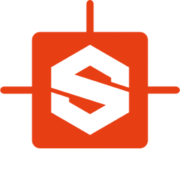
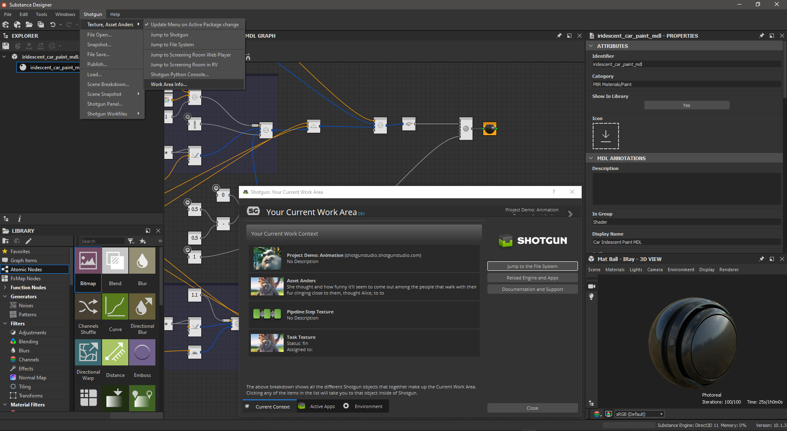
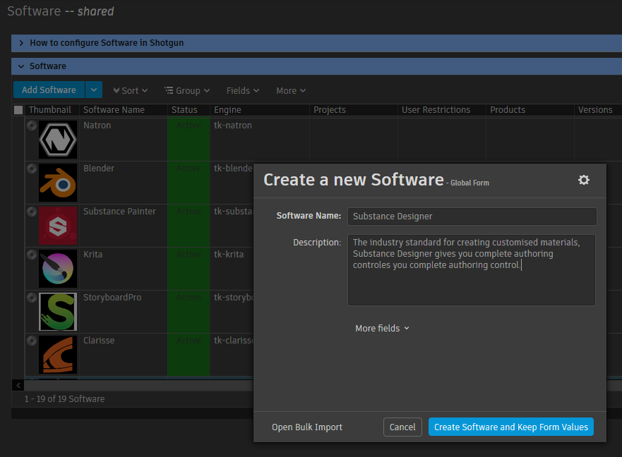
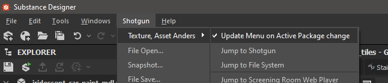
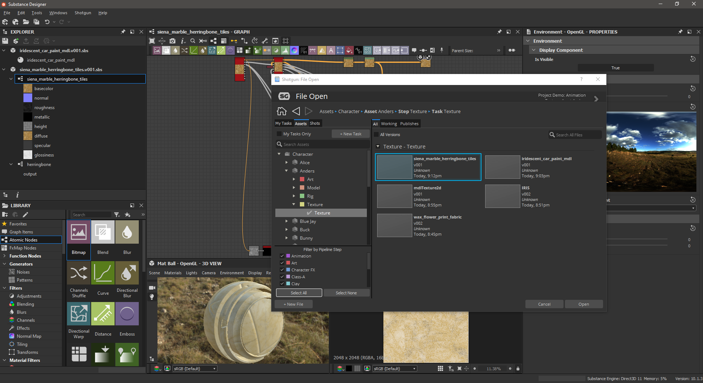
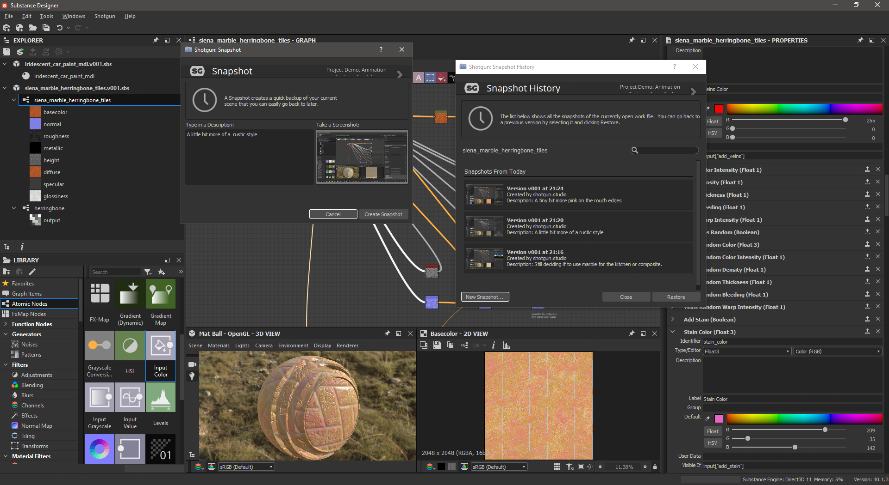
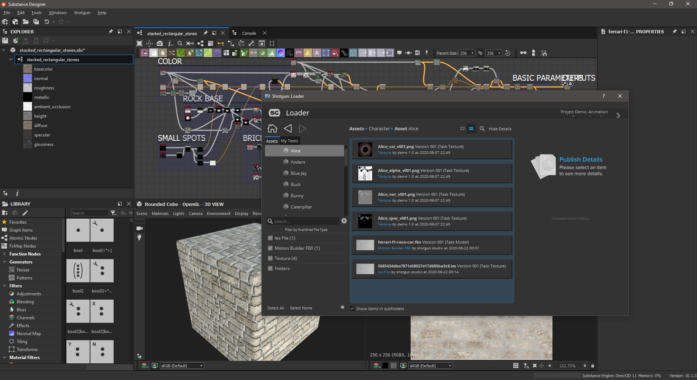
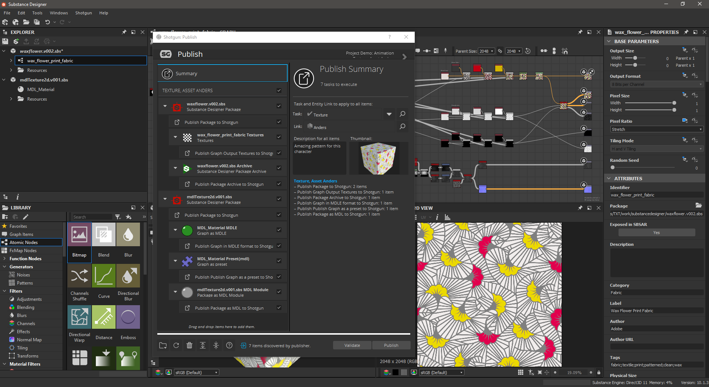
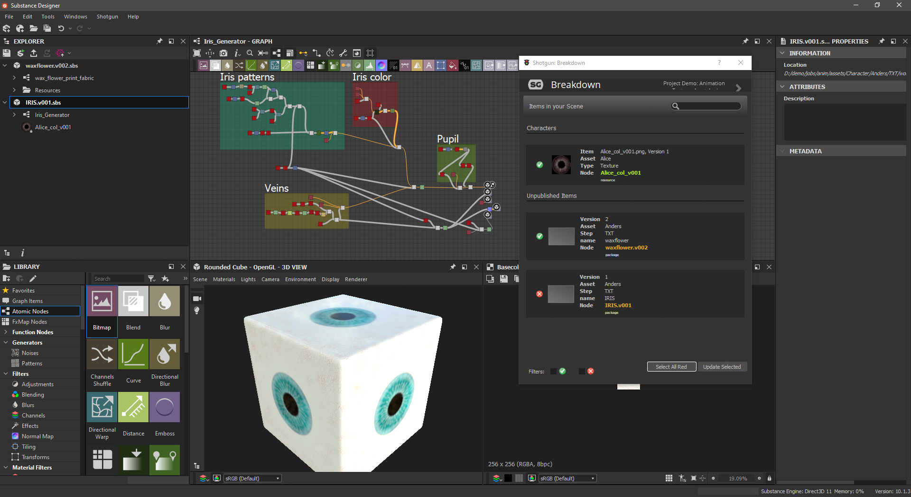

# Shotgun toolkit engine for Substance Designer

Contact : [Diego Garcia Huerta](https://www.linkedin.com/in/diegogh/)



## Overview

Implementation of a shotgun engine for [**Substance Designer**](https://www.substance3d.com/products/substance-designer/). It supports the classic bootstrap startup methodology and integrates with Substance Designer adding a new Shotgun Menu in the main tool-bar.

* [Engine Installation](#engine-installation)
* [Configuring your project for Shotgun Toolkit](#configuring-your-project-for-shotgun-toolkit)
* [Modifying the toolkit configuration files to add this engine and related apps](#modifying-the-toolkit-configuration-files-to-add-this-engine-and-related-apps)
* [Modifying the Templates](#modifying-the-templates)
* [Copying the core hooks for this engine](#copying-the-core-hooks-for-this-engine)
* [Configuring Substance Designer in the software launcher](#configuring-substance-designer-in-the-software-launcher)
* [Caching and downloading the engine into disk](#caching-and-downloading-the-engine-into-disk)
* [Substance Designer engine should be ready to use](#substance-designer-engine-should-be-ready-to-use)
* [Toolkit Apps Included](#toolkit-apps-included)

With the engine, hooks for most of the standard tk applications are provided:

* [tk-multi-workfiles2](#tk-multi-workfiles2)
* [tk-multi-snapshot](#tk-multi-snapshot)
* [tk-multi-loader2](#tk-multi-loader2)
* [tk-multi-publish2](#tk-multi-publish2)
* [tk-multi-breakdown](#tk-multi-breakdown)

Engine available options and development notes:
* [Substance Designer engine options](#substance-designer-engine-options)
* [Development notes](#development-notes)
  * [Substance Designer engine bootstrap](substance-designer-engine-bootstrap)
  * [Substance Designer development notes](#substance-designer-development-notes)

**Disclaimer**

**This engine has been developed and tested in Windows 10 using Substance Designer version 2020.1.3 (10.1.3)**

The engine has not been used in production before so **use it at your own risk**. Also keep in mind that some of the hooks provided might need to be adapted to your work flows and pipelines. If you use it in production, I would love to hear about it, drop me a message in the contact link at the beginning of this documentation.


## Engine Installation

When I started using shotgun toolkit, I found quite challenging figuring out how to install and configure a new tk application or a new engine. Shotgun Software provides extensive documentation on how to do this, but I used to get lost in details, specially with so many configuration files to modify.

If you are familiar with how to setup an engine and apps, you might want to skip the rest of this document, just make sure to check the [templates](config/core/templates.yml) and [additions to the configs](config/env) that might give you a good start.

If you are new to shotgun toolkit, I also recommend to read at least the following articles, so you get familiar with how the configuration files are setup, and the terminology used:

* [App and Engine Configuration Reference](https://support.shotgunsoftware.com/hc/en-us/articles/219039878-App-and-Engine-Configuration-Reference)
* [Overview of Toolkit's New Default Configuration](https://support.shotgunsoftware.com/hc/en-us/articles/115004077494-Overview-of-Toolkit-s-New-Default-Configuration-)

Here are detailed instructions on how to make this engine work assuming you use a standard shotgun toolkit installation and have downloaded shotgun desktop.
[Shotgun Desktop Download Instructions](https://support.shotgunsoftware.com/hc/en-us/articles/115000068574#Getting%20started%20with%20Shotgun%20Desktop)

Also, an amazing resource to look for help when configuring your engine, is the [Shotgun Community Forums](https://community.shotgunsoftware.com/), specifically under *Pipeline Integrations* category.

Finally, this link contains the technical reference for Shotgun toolkit and related technologies, a great effort to collate all the tech documentation in a single place:
[Shotgun's Developer Documentation](https://developer.shotgunsoftware.com/)

## Configuring your project for Shotgun Toolkit

If you haven't done it yet, make sure you have gone through the basic steps to configure your project to use shotgun toolkit, this can be done in shotgun desktop app, by:
* enter into the project clicking it's icon

* click on the user icon to show more options (bottom right)

* click on *Advanced project setup*

    

* *Select a configuration*: "Shotgun Default" or pick an existing project that you have already setup pages and filters for.


* *Select a Shotgun Configuration*: select "default" which will download the standard templates from shotgun. (this documentation is written assuming you have this configuration)


* *Define Storages*: Make sure you name your first storage "primary", and a choose a primary folder where all the 'jobs' publishes will be stored, in this case "D:\demo\jobs" for illustrative purposes.


* *Project Folder Name*: This is the name of the project in disk. You might have some sort of naming convention for project that you might follow, or leave as it is. (My advice is that you do not include spaces in the name)


* *Select Deployment*: Choose "Centralized Setup". This will be the location of the configuration files (that we will be modifying later). For example, you could place the specific configuration for a project (in this example called game_config) within a folder called "configs" at the same level then the jobs folder, something like:
```shell
├───jobs
└───configs
    └───game_config
        ├───cache
        ├───config
        │   ├───core
        │   │   ├───hooks
        │   │   └───schema
        │   ├───env
        │   │   └───includes
        │   │       └───settings
        │   ├───hooks
        │   │   └───tk-multi-launchapp
        │   ├───icons
        │   └───tk-metadata
        └───install
            ├───apps
            ├───core
            ├───engines
            └───frameworks
```
(Note that this might not be suitable for more complex setups, like distributed configurations)


## Modifying the toolkit configuration files to add this engine and related apps

Every pipeline configuration has got different environments where you can configure apps accordingly. (for example you might want different apps depending if you are at an asset context or a shot context. The configured environments really depend on your projects requirements. While project, asset, asset_step, sequence, shot, shot_step, site are the standard ones, it is not uncommon to have a sequence_step environment or use a episode based environment either.

I've included a folder called 'config' in this repository where you can find the additions to each of the environments and configuration YAML files that come with the [default shotgun toolkit configuration repository](https://github.com/shotgunsoftware/tk-config-default2) (as of writing)

[configuration additions](config)

These YAML files provided **should be merged with the original ones as they won't work on their own.**

As an example, for the location of the engine, we use a git descriptor that allows up to track the code from a git repository. This allows easy updates, whenever a new version is released. So in the example above, you should modify the file:
``.../game_config/config/env/includes/engine_locations.yml``

and add the following changes from this file:
[engine_locations.yml](config/env/includes/engine_locations.yml)

```yaml
# Substance Designer
engines.tk-substancedesigner.location:
  type: git
  branch: master
  path: https://github.com/diegogarciahuerta/tk-substancedesigner.git
  version: v1.0.0
```

**Do not forget to update the version of the engine to the latest one. You can check here which one is the [latest version](https://github.com/diegogarciahuerta/tk-substancedesigner/releases)**

In your environments you should add tk-substancedesigner yml file, for example in the asset_step yml file:
``/configs/game_config/env/asset_step.yml``

Let's add the include at the beginning of the file, in the 'includes' section:
```yaml
- ./includes/settings/tk-substancedesigner.yml
```

Now we add a new entry under the engines section, that will include all the information for our Substance Designer application:
```yaml
  tk-substancedesigner: "@settings.tk-substancedesigner.asset_step"
```

And so on.

Finally, do not forget to copy the additional `tk-substancedesigner.yml` into your settings folder.


## Modifying the Templates

The additions to `config/core/templates.yml` are provided also under the config directory of this repository, specifically:

[templates.yml](config/core/templates.yml)


## Copying the core hooks for this engine

In this engine, there is a core hook that is used to automatically choose a name when `File Save` is used for the current package.

Copy the following core hook:
[saveas_default_name_tk-substancedesigner](config/core/hooks/tk-multi-workfiles2/saveas_default_name_tk-substancedesigner.py)

To the equivalent location into `config/core/hooks` inside your pipeline configuration folder.

## Configuring Substance Designer in the software launcher

In order for our application to show up in the shotgun launcher, we need to add it to our list of software that is valid for this project.

* Navigate to your shotgun URL, ie. `example.shotgunstudio.com`, and once logged in, clink in the Shotgun Settings menu, the arrow at the top right of the web page, close to your user picture.
* Click in the Software menu


* We will create a new entry for Substance Designer, called "Substance Designer" and whose description can be conveniently copy and pasted from [Substance Designer page entry](https://www.substance3d.com/products/substance-designer/)


* We now should specify the engine this software will use. "tk-substancedesigner"


* Note that you can restrict this application to certain projects by specifying the project under the projects column. If no projects are specified this application will show up for all the projects that have this engine in their configuration files.

If you want more information on how to configure software launches, here is the detailed documentation from shotgun.
[Configuring software launches](https://support.shotgunsoftware.com/hc/en-us/articles/115000067493#Configuring%20the%20software%20in%20Shotgun%20Desktop)


## Caching and downloading the engine into disk

One last step is to cache the engine and apps from the configuration files into disk. Shotgun provides a tank command for this.
[Tank Advanced Commands](https://support.shotgunsoftware.com/hc/en-us/articles/219033178-Administering-Toolkit#Advanced%20tank%20commands)

* Open a console and navigate to your pipeline configuration folder, where you will find a `tank` or `tank.bat` file.
(in our case we placed the pipeline configuration under `D:\demo\configs\game_config`)

* type `tank cache_apps` , and press enter. Shotgun Toolkit will start revising the changes we have done to the configuration YAML files and downloading what is requires.


## Substance Designer engine should be ready to use:

If we now go back and forth from our project in shotgun desktop ( < arrow top left if you are already within a project ), we should be able to see Substance Designer as an application to launch.


## Substance Designer engine options:

There is one configurable option that I thought might be convenient to have. Substance Designer does not seem to have the concept of a session where all the packages within the session are saved as a session file.
Since you can have multiple packages opened, it might be convenient to have a way to automatically switch context when the user changes the active graph. This means that the shotgun menu would be updated when going from one graph to a different one if they represent different contexts, ie. going from an assetA graph to a different graph that represents assetB.

This is driven by an option in the engine called:
```yaml
    active_package_context_switch:
        type: bool
        description: "Controls whether the engine should attempt to automatically adjust its context every time the active graph changes, ie. when the artist has multiple packages opened and switch between the graphs within them."
        default_value: False

```
To make it active by default, simple add it to your tk-substancedesigner.yml as an option:

`active_package_context_switch: True`

Note that you can always change this behaviour via Shotgun Menu -> Context Menu -> Update Menu on Active Package Change



## Toolkit Apps Included

## [tk-multi-workfiles2](https://support.shotgunsoftware.com/hc/en-us/articles/219033088)


This application forms the basis for file management in the Shotgun Pipeline Toolkit. It lets you jump around quickly between your various Shotgun entities and gets you started working quickly. No path needs to be specified as the application manages that behind the scenes. The application helps you manage your working files inside a Work Area and makes it easy to share your work with others.

Basic  have been implemented for this tk-app to work. open, save, save_as, reset, and current_path are the scene operations implemented. All operations happens at the package level, based on the current graph active in the Graph Window.

## [tk-multi-snapshot](https://support.shotgunsoftware.com/hc/en-us/articles/219033068)


A Shotgun Snapshot is a quick incremental backup that lets you version and manage increments of your work without sharing it with anyone else. Take a Snapshot, add a description and a thumbnail, and you create a point in time to which you can always go back to at a later point and restore. This is useful if you are making big changes and want to make sure you have a backup of previous versions of your scene.

 is provided to be able to use this tk-app, and similar to workfiles2 is based on the graph displayed in the Graph Window.

## [tk-multi-loader2](https://support.shotgunsoftware.com/hc/en-us/articles/219033078)


The Shotgun Loader lets you quickly overview and browse the files that you have published to Shotgun. A search-able tree view navigation system makes it easy to quickly get to the task, shot or asset that you are looking for and once there the loader shows a thumbnail based overview of all the publishes for that item. Through configurable hooks you can then easily reference or import a publish into your current scene.

 for this tk app supports any PublishedFile that Substance Designer can import as a resource into a package. The following actions are available:
- `bitmap`: Import as a Bitmap resource in the current Package
- `svg`: Import as a Vector Graphics resource in the current Package
- `font`: Import as a Font resource in the current Package
- `scene`: Import as a Scene resource in the current Package
- `light_profile`: Import as a resource Light Profile in the current Package
- `bsdf_measurement`: Import as a resource BSDF Measurement in the current Package

## [tk-multi-publish2](https://support.shotgunsoftware.com/hc/en-us/articles/115000097513)


The Publish app allows artists to publish their work so that it can be used by artists downstream. It supports traditional publishing workflows within the artist’s content creation software as well as stand-alone publishing of any file on disk. When working in content creation software and using the basic Shotgun integration, the app will automatically discover and display items for the artist to publish. For more sophisticated production needs, studios can write custom publish plugins to drive artist workflows.

The publishing mechanism of this engine allows all the user packages that are currently loaded in substance designer to be published. Publishing those packages are .sbs if the default, but may more options are provided by default that you might want to configure:

Package based:
- Package Publish (.sbs format)
- Package Publish as an Archive (.sbsar format)
- Package Publish as a MDL Export  (.mdl format)

Graph Based:
- Publish Graphs outputs as a Texture Folder. Note that here you can define the format to export by changing the `Texture Format` option in the 
Make sure you choose your desired behaviour in the configuration for this app, under the Substance Designer section of , for example:
```yaml
  - name: Publish Graph Output Textures to Shotgun
    ...
    settings:
        Publish Template: substancedesigner_asset_graph_textures_path_publish
        Texture Format: exr

```
- Publish Graphs as presets  (.mdl format)
- Publish Graphs as encapsulated MLD, (.mdle format)

All the hooks for the publisher are located here: .

## [tk-multi-breakdown](https://support.shotgunsoftware.com/hc/en-us/articles/219032988)


The Scene Breakdown App shows you a list of items you have loaded (referenced) in your scene and tells you which ones are out of date.
**Note that only packages can be updated at the moment**
I could not find a way to update resources. Please contact me if you have a way forward with this code wise. While it can be done through the UI, it seems it is locked code wise as an Exception `SDApiError.DataIsReadOnly` is thrown when trying to modify the property.

 is provided to display the current elements that match any template from Substance Designer engine.

## Development notes:

### Substance Designer engine bootstrap

The way this engine works is via a python plugin [shotgun_bridge](resources/plugins/shotgun_bridge) that triggers the instancing of the Substance Designer toolkit engine. Once the engine is up and running, the [menus](python/tk_substancedesigner/menu_generation.py) are created as normal using PySide2 widgets, very similar to other engines.

### Substance Designer development notes
Substance Designer API is fairly clean and easy to understand for someone like me that had not used the software before. If feels well structured and easy to understand, and most complications come from understanding how UI and the API work together.

While I was developing the engine, I encounter a few things that I think would make Substance Designer a more pipeline friendly application:

**API access to the current selected package(s)**

In a few occasions I needed to know what package was selected in the Explorer. This is not doable from code as far as I know, so I tried unsuccessfully to retrieve this information from the Explorer. An additional method in the API to get the current package(s) selected would be convenient as many operations rely on this. The solution so far is to use the active graph in the Graph Window, and from there get the package for that graph. The issue is that the graph has to be really active in the Graph Window, it is not enough to have it selected in the Explorer Window.

**Setting file path properties**

When implementing the hooks for `tk-multi-loader2`, it felt like everything was in place for updating packages and items that represented file like resources.
Unfortunately while this can be done in the Property editor in the UI, it seems like trough code it is not possible to change the `file_path` property of a resource. It always throws an Exception `SDApiError.DataIsReadOnly` when trying to modify the property.

**Substance Designer Inputs and Output**

In general I found confusing the amount of input/outputs that Substance Designer supports. Probably because I'm not familiar with it from the artist perspective, MDL, MDLE, SBSAR, SBS, Presets, from a graph , from a package, etc... There are way too many different things you can output from either of those, and found tricky to make sense of them. You will notice I tried to support as much as possible in `tk-multi-publish2`. You most likely need a quarter of all the outputs that I left default configured.

***

For completion, I've kept the original README from shotgun, that include very valuable links:

## Documentation
This repository is a part of the Shotgun Pipeline Toolkit.

- For more information about this app and for release notes, *see the wiki section*.
- For general information and documentation, click here: https://support.shotgunsoftware.com/entries/95441257
- For information about Shotgun in general, click here: http://www.shotgunsoftware.com/toolkit

## Using this app in your Setup
All the apps that are part of our standard app suite are pushed to our App Store.
This is where you typically go if you want to install an app into a project you are
working on. For an overview of all the Apps and Engines in the Toolkit App Store,
click here: https://support.shotgunsoftware.com/entries/95441247.

## Have a Question?
Don't hesitate to contact us! You can find us on support@shotgunsoftware.com
